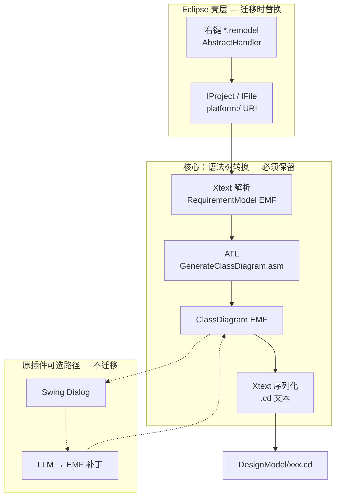

# com.rm2pt.rapidood.generator 架构分析

> 分析对象：`设计模型生成RapidOOD/RapidOOD/com.rm2pt.rapidood.generator`  
> 迁移范围说明：Spring Boot 化 **仅覆盖 ATL 生成链路**；原插件中的 LLM 增强（`DomainModelDesignDialog`）**不在本次迁移范围内**。

---

## 1. 插件本质（一句话）

```
.remodel 文本
  → [Xtext] RequirementModel（EMF 语法树 A）
  → [ATL]   ClassDiagram（EMF 语法树 B）
  → [Xtext] .cd 文本
```

**核心**：一种抽象语法树（REMODEL 元模型实例）经 ATL 规则，转换为另一种抽象语法树（ClassDiagram 元模型实例）。  
**Eclipse 的角色**：提供 Xtext/EMF/ATL 运行时，以及工作区资源、右键菜单等 IDE 集成壳层——**不是转换算法本身**。

原插件在 ATL 之后还有 **LLM 对 ClassDiagram 的补丁**（职责分配、领域划分），属于同一插件内的 **第二阶段**，但与 ATL 解耦；本次 Spring Boot 迁移 **止于 ATL 输出 `.cd`**。

---

## 2. 输入输出

### 2.1 用户可见的文件级 I/O（迁移目标范围）

| 层次 | 输入 | 输出 |
|------|------|------|
| **主路径（本次迁移）** | 工作区内 `*.remodel` | `{项目}/DesignModel/{同名}.cd` |
| **触发方式** | 右键 `.remodel` → Generate Domain Design Model | — |
| **原插件扩展路径（不迁移）** | ATL 生成后的 cd + 用户操作 Swing 对话框 | LLM 修改后的 `.cd` |

### 2.2 EMF 模型级 I/O（语法树层）

| 阶段 | 输入树 | 输出树 | 执行组件 |
|------|--------|--------|----------|
| 解析 | `.remodel` 字符流 | `RequirementModel` 根对象 | `REMODELStandaloneSetup` + Xtext |
| **ATL 转换** | REMODEL 元模型实例（如 `DomainModel`、`Entity`） | `ClassDiagram` 根对象 | `RunATL` + `GenerateClassDiagram.asm` |
| 持久化 | `ClassDiagram` EMF 实例 | 磁盘 `.cd`（或 XMI） | EMF Extractor + Xtext 序列化 |
| LLM 补丁（不迁移） | `Contract` / `ClassDiagram` 文本片段 | 修改后的 `ClassDiagram` | `DomainModelDesignDialog` |

### 2.3 ATL 转换的输入输出

`RunATL.run()` 的模型边界：

| 项目 | 值 |
|------|-----|
| 输入元模型 NS | `http://www.mydreamy.net/requirementmodel/REMODEL` |
| 输出元模型 NS | `http://www.rm2pt.com/rapidood/cd/ClassDiagram` |
| 输入模型变量 | `IN : RM` |
| 输出模型变量 | `OUT : CDM` |
| 转换程序 | `GenerateClassDiagram.asm`（运行时；比仓库 `.atl` 更完整） |

**主要映射规则**（`GenerateClassDiagram.atl` / `.asm`）：

| 源（REMODEL） | 目标（ClassDiagram） |
|---------------|----------------------|
| `DomainModel` | `ClassDiagram` |
| `Entity` | `Class` + `Attribute` |
| `Entity`（带 CRUD，`.asm`） | `Class` + `XxxRepository` |
| `Reference` | `Relationship` |
| `EnumEntity` | `Enum` + `ReferType` |
| `superEntity` | 泛化 `Relationship` |

### 2.4 各步骤 I/O 汇总表

| 步骤 | 输入 | 输出 | 类型 |
|------|------|------|------|
| 用户触发 | 选中 `.remodel` | — | Eclipse 选择 |
| Xtext 解析 | `.remodel` 文本 | `RequirementModel` EMF | 语法树 A |
| **ATL（迁移终点逻辑）** | EMF 树 A | EMF 树 B | 模型转换 |
| EMF 持久化 | EMF 树 B | `DesignModel/*.cd` | PlantUML 子集文本 |
| LLM 增强（原插件有，不迁移） | 树 A/B 文本片段 | 补丁后的树 B | HTTP + JSON |

---

## 3. 完整数据流



### 3.1 Handler 编排（`DomainDesignModelGeneratorHandler`）

迁移时 **只保留前半段**（至 ATL + 加载 cd），**不迁移** `enhanceModel()`：

```java
// 1. platform URI 加载 remodel
URI uri = URI.createPlatformResourceURI(file.getFullPath().toString(), true);
REMODELStandaloneSetup → Resource rmResource

// 2. ATL 转换，写出 DesignModel/xxx.cd
URI cdUri = runatl.run(uri, name, project);

// 3. 加载 cd
ClassDiagramStandaloneSetup → Resource cdResource

// 4. 【不迁移】Swing + LLM
enhanceModel(rmResource, cdResource);
```

---

## 4. Eclipse 提供了什么 vs 插件实现了什么

| 能力 | 提供者 | 在 generator 中的用途 | 迁移策略 |
|------|--------|----------------------|----------|
| `.remodel` 解析 | Xtext + REMODEL 插件 | 文本 → 语法树 A | **保留** StandaloneSetup |
| `.cd` 序列化 | Xtext + cd 插件 | 语法树 B → 文本 | **保留** StandaloneSetup |
| 树 A → 树 B | ATL + `.asm` | 核心转换 | **保留**，去 OSGi 加载方式 |
| EMF 运行时 | Eclipse EMF | 两棵树的内存表示 | **保留** Maven 依赖 |
| 工作区 URI | `IProject` / `platform:/` | 定位文件 | **替换** `file:/` |
| 右键菜单 | `plugin.xml` + Handler | 触发 | **替换** REST |
| 加载 `.asm` | `Platform.getBundle` | OSGi classpath | **替换** `ClassLoader.getResourceAsStream` |
| Swing + LLM | `DomainModelDesignDialog` | 树 B 补丁 | **不迁移** |
| Sirius | MANIFEST 声明，源码未用 | 无 | **不引入** |

---

## 5. 模块与源码对照

```
com.rm2pt.rapidood.generator/
├── plugin.xml                          # Eclipse 菜单 → Spring Controller
├── GenerateClassDiagram.asm            # ATL 运行时（核心）
├── GenerateClassDiagram.atl            # 规则文档（与 asm 不完全一致）
├── handlers/
│   └── DomainDesignModelGeneratorHandler.java   # 编排（ATL 部分迁移）
├── atl/
│   └── RunATL.java                     # ATL 执行器（重构为 Service）
└── ui/
    └── DomainModelDesignDialog.java    # LLM UI（不迁移）
```

| 文件 | 是否迁移 | 说明 |
|------|----------|------|
| `RunATL.java` | ✅ | 核心 |
| `DomainDesignModelGeneratorHandler.java` | ✅ 部分 | 仅 load → ATL → serialize |
| `GenerateClassDiagram.asm` | ✅ | classpath 资源 |
| `DomainModelDesignDialog.java` | ❌ | LLM，范围外 |
| `plugin.xml` | ❌ | 由 REST 替代 |
| `SampleHandler.java` | ❌ | 示例代码 |

---

## 6. 依赖关系

```
net.mydreamy.requirementmodel     →  解析 .remodel（语法树 A）
com.rm2pt.rapidood.cd             →  解析/序列化 .cd（语法树 B）
org.eclipse.m2m.atl.*             →  ATL 引擎
org.eclipse.emf.*                 →  EMF 树
org.eclipse.xtext                 →  DSL 前端（非 xtext.ui）
com.google.gson                   →  仅 LLM Dialog 使用（迁移不需要）
org.eclipse.ui / core.resources   →  Eclipse 壳（迁移删除）
```

---

## 7. Spring Boot 迁移为何这样划分（对应执行计划）

迁移原则：**先保语法树转换，再保编排，最后换触发壳**；**不包含 LLM pass**。

| 阶段 | 对应插件层次 | 原因 |
|------|--------------|------|
| **阶段一** | `RunATL` + StandaloneSetup | 验证无 Eclipse IDE 下 ATL 树→树转换 |
| **阶段二** | Handler 前半段 | 串联解析、ATL、序列化，去掉 `IProject`/Swing |
| **阶段三** | `plugin.xml` | REST 触发：读本地 `.remodel` → 写本地 `DesignModel/*.cd` |

用编译器类比：

> **原插件** = 前端 A（remodel）+ **中间转换（ATL）** + 前端 B（cd）+ IDE 壳 + *可选 LLM 重写 pass*  
> **本次迁移** = 保留三个「编译」阶段，IDE 壳 → HTTP；**不做 LLM pass**

---

## 8. 风险与注意事项

| 项 | 说明 |
|----|------|
| `.asm` vs `.atl` | 运行以 **`.asm`** 为准；`.atl` 可能缺少 `Entity2ClassAndRepo` 等规则 |
| REMODEL 插件 | 最大阻塞：需 Standalone JAR 或 RM2PT 源码模块 |
| Handler 注释 | 写「Service + Repository 生成」，实际以 `.asm` 内容为准 |
| LLM 路径 | 原插件 `enhanceModel()` 会弹窗阻塞；Spring Boot 版直接返回 ATL 结果 |

---

## 9. 迁移后预期 API（仅 ATL）

采用 **本地文件 I/O**，不做 HTTP 文件上传。

| 方法 | 路径 | 输入（本地） | 输出（本地） |
|------|------|--------------|--------------|
| POST | `/api/v1/generate/class-diagram` | `inputPath`：`.remodel` 绝对路径（或 yml 默认） | 写入 `outputPath`：`{输入目录}/DesignModel/{basename}.cd` |
| GET | `/actuator/health` | — | — |

**路径示例**（与原 Eclipse 插件对齐）：

```
输入：/data/rapidood/input/CoCoME.remodel
输出：/data/rapidood/input/DesignModel/CoCoME.cd
```

**API 响应**返回 `inputPath` 与 `outputPath`，便于调用方确认落盘位置；`.cd` 内容在输出文件中，不强制放在 JSON body 里。

---

*配套文档：`执行计划.md`（三阶段 × 2 天，范围至 ATL 生成）*
