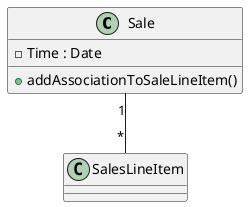
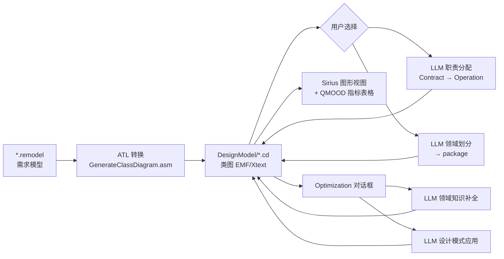

# RapidOOD 程序理解：输入与输出分析

> 分析路径：`设计模型生成RapidOOD/RapidOOD/`  
> 平台：Eclipse RCP 插件（OSGi），基于 EMF + Xtext + ATL + Sirius + Swing 对话框

---

## 1. 程序总体功能

RapidOOD 是一套 **Eclipse 插件工具链**，在 RM2PT 需求建模环境之上，实现面向对象设计模型的：

| 阶段 | 插件模块 | 用户入口 |
|------|----------|----------|
| **设计生成** | `com.rm2pt.rapidood.generator` | 右键 `.remodel` → RapidOOD → Generate Domain Design Model |
| **质量评估** | `com.rm2pt.rapidood.classdiagram.design` | 打开 `.cd` 的 Sirius 图形视图时自动计算指标 |
| **设计优化** | `com.rm2pt.rapidood.optimization` | 右键 `.cd` → RapidOOD → Optimize Design Model |

此外还提供两类 **Xtext 文本 DSL 编辑器**（手工编辑设计模型）：

- `com.rm2pt.rapidood.cd`：类图（`.cd`）
- `com.rm2pt.rapidood.sd`：序列图（`.sd`）

---

## 2. 模块结构与依赖关系

```
┌─────────────────────────────────────────────────────────────┐
│  外部输入：*.remodel（RM2PT 需求模型）                        │
│  依赖插件：net.mydreamy.requirementmodel                     │
└──────────────────────────┬──────────────────────────────────┘
                           │
                           ▼
┌─────────────────────────────────────────────────────────────┐
│  com.rm2pt.rapidood.generator                               │
│  ATL: GenerateClassDiagram.asm (.remodel → 类图 EMF 模型)   │
│  Swing UI: DomainModelDesignDialog（LLM 增强）             │
└──────────────────────────┬──────────────────────────────────┘
                           │ 输出 DesignModel/*.cd
                           ▼
┌─────────────────────────────────────────────────────────────┐
│  com.rm2pt.rapidood.cd (+ .cd.ui)                           │
│  Xtext DSL：PlantUML 子集类图文本                             │
│  Sirius 图形化：com.rm2pt.rapidood.classdiagram.design       │
└──────────────────────────┬──────────────────────────────────┘
                           │
              ┌────────────┴────────────┐
              ▼                         ▼
┌─────────────────────────┐  ┌─────────────────────────────┐
│  classdiagram.design     │  │  com.rm2pt.rapidood.optimization │
│  QMOOD 指标自动计算       │  │  LLM 设计优化对话框              │
│  （Sirius Services）      │  │  （领域知识补全 / 设计模式应用）   │
└─────────────────────────┘  └─────────────────────────────┘

注：com.rm2pt.rapidood.sd 提供序列图 DSL，但本仓库中
    **未发现** 从需求模型自动生成序列图的 Handler/ATL。
```

---

## 3. 核心数据模型（元模型）

### 3.1 需求模型（输入侧）

- **来源插件**：`net.mydreamy.requirementmodel`
- **文件扩展名**：`.remodel`
- **命名空间**：`http://www.mydreamy.net/requirementmodel/REMODEL`
- **根对象**：`RequirementModel`

程序中实际用到的子结构：

| 模型元素 | Java 类型 | 用途 |
|----------|-----------|------|
| 领域模型 | `DomainModel` | ATL 转换源；LLM 职责分配时的「领域类」文本 |
| 实体 | `Entity` / `Attribute` / `Reference` | ATL 转为设计类、属性、关联 |
| 用例模型 | `UseCaseModel` | 读取系统操作合约列表 |
| 系统操作合约 | `Contract` | LLM 职责分配的单条输入 |
| 系统操作 | `Operation` + `Parameter` | 职责分配结果写回类图 Operation |

需求模型在 Eclipse 工程中通常与 RM2PT 工具一同维护，包含用例图、概念类图、系统序列图、OCL 合约等（由 REMODEL 语法描述）。

### 3.2 类图设计模型（中间/输出侧）

- **DSL 语法文件**：`ClassDiagram.xtext`
- **文件扩展名**：`.cd`
- **命名空间**：`http://www.rm2pt.com/rapidood/cd/ClassDiagram`
- **文本格式**：PlantUML 子集，以 `@startuml` … `@enduml` 包裹

支持的元素：`class`、`interface`、`abstract class`、`enum`、`package`、类间 `Relationship`、属性、方法等。

示例结构：



### 3.3 序列图设计模型（仅编辑器，无自动生成入口）

- **DSL 语法文件**：`SequenceDiagram.xtext`
- **文件扩展名**：`.sd`
- **命名空间**：`http://www.rm2pt.com/rapidood/sd/SequenceDiagram`

本仓库提供编辑与 Sirius 视图，但 **生成插件未包含** `.remodel` → `.sd` 的转换逻辑。

---

## 4. 三大功能的输入输出详解

### 4.1 设计生成（Generator）

**入口类**：`DomainDesignModelGeneratorHandler`  
**触发条件**：在 Eclipse 项目内选中或打开 `*.remodel` 文件

#### 输入

| 输入项 | 类型/格式 | 说明 |
|--------|-----------|------|
| 需求模型文件 | `项目根/**/*.remodel` | RM2PT 轻量形式化需求模型 |
| EMF 资源 URI | `platform:/resource/{项目}/{路径}.remodel` | 由 Handler 解析得到 |
| ATL 转换规则 | `GenerateClassDiagram.asm` | 编译后的 ATL 字节码（运行时加载） |
| LLM API（可选） | HTTPS JSON | `DomainModelDesignDialog` 中调用 GPT-4o |

ATL 源文件 `GenerateClassDiagram.atl` 与编译产物 `GenerateClassDiagram.asm` **不完全一致**；实际运行以 `.asm` 为准。`.asm` 中包含 `Entity2ClassAndRepo` 等规则，可为带 CRUD 注解的实体生成 `XxxRepository` 类。

ATL 主要转换规则（需求 → 类图）：

- `DomainModel` → `ClassDiagram`
- `Entity` → `Class`（含 Getter/Setter 对应属性）
- `Entity`（CRUD）→ `Class` + `XxxRepository`
- `Reference` → `Relationship`
- `EnumEntity` → `Enum` + `ReferType`
- 继承关系 `superEntity` → 泛化 `Relationship`

#### 输出

| 输出项 | 路径/格式 | 说明 |
|--------|-----------|------|
| 初始类图模型 | `{项目}/DesignModel/{原名}.cd` | ATL 提取的 EMF/Xtext 资源 |
| 更新后的类图 | 同上 `.cd` 文件 | 用户在对话框中「采用结果」后保存 |
| LLM 中间结果 | Swing 文本框（JSON） | 不落盘，仅 UI 展示 |

**生成流程**：

```
.remodel
  → EMF 加载 RequirementModel
  → RunATL.run() 执行 ATL 转换
  → 写出 DesignModel/xxx.cd
  → 弹出 DomainModelDesignDialog
       ├─ 职责分配：Contract + DomainModel → LLM → Class.operations
       └─ 领域划分：ClassDiagram 文本 → LLM → package 结构
  → cdResource.save() 持久化
```

**LLM 职责分配输出格式**（JSON）：

```json
{
  "Operation": "系统操作名",
  "owner": "目标类名",
  "reasoning": "分配理由"
}
```

**LLM 领域划分输出格式**（JSON）：

```json
{
  "package": [
    {
      "name": "包名",
      "classes": ["类1", "类2"],
      "reasoning": "划分理由"
    }
  ]
}
```

---

### 4.2 质量评估（ClassDiagram Design / Sirius）

**入口**：打开 `.cd` 文件并激活 Sirius 类图 viewpoints（插件 `com.rm2pt.rapidood.classdiagram.design`）  
**核心类**：`Services.java` + `Activator.java`

#### 输入

| 输入项 | 类型 | 说明 |
|--------|------|------|
| 类图 EMF 模型 | `ClassDiagram` 对象 | 从当前 Sirius Session 语义资源读取 |
| 类/属性/操作/关系 | `AbstractElement` 集合 | 遍历 `cd.getElements()` 统计 |

#### 输出

**不在文件中导出**，而是在 Swing 窗口「设计质量评估」中展示两类表格：

**底层度量指标（11 项）**：

| 简称 | 含义 | 计算来源 |
|------|------|----------|
| DSC | 类数量 | 统计 Class 个数 |
| NOH | 层次数 | 代码中暂固定为 3 |
| ANA | 平均祖先数 | 继承链分析 |
| DAM | 直接访问指标 | 属性/方法访问分析 |
| DCC | 直接类间耦合 | 关联/依赖计数 |
| CAM | 类内方法内聚 | 方法内聚计算 |
| MOA | 组合度量 | 组合关系分析 |
| MFA | 功能抽象度量 | 祖先方法数等 |
| NOP | 多态方法数 | 代码中部分硬编码 |
| CIS | 类接口大小 | 公共方法总数 |
| NOM | 方法总数 | 所有 Operation 计数 |

**高层质量属性（6 项 QMOOD）**：以第一次计算为基准，后续按相对比值公式计算：

| 质量属性 | 计算公式（代码中） |
|----------|-------------------|
| 可重用性 Reusability | −0.25×DCC + 0.25×CAM + 0.5×CIS + 0.5×DSC |
| 灵活性 Flexibility | 0.25×DAM − 0.25×DCC + 0.5×MOA + 0.5×NOP |
| 可理解性 Understandability | −0.33×ANA + 0.33×DAM − 0.33×DCC + … |
| 功能性 Functionality | 0.12×CAM + 0.22×NOP + 0.22×CIS + … |
| 可扩展性 Extendibility | 0.5×ANA − 0.5×DCC + 0.5×MFA + 0.5×NOP |
| 有效性 Effectiveness | 0.2×ANA + 0.2×DAM + 0.2×MOA + … |

每次模型变更触发 Sirius Service 重算，表格追加一行历史记录，并用颜色标识升降。

---

### 4.3 设计优化（Optimization）

**入口类**：`DesignModelOptimizationHandler`  
**触发条件**：选中 `*.cd` 文件 → RapidOOD → Optimize Design Model

#### 输入

| 输入项 | 类型 | 说明 |
|--------|------|------|
| 类图文件 | `*.cd` | 已生成的设计模型 |
| 类图文本 | PlantUML 子集字符串 | 由 `NodeModelUtils.getNode(cd).getText()` 提取 |
| LLM API | HTTPS JSON | GPT-4o（chatfire.cn 代理） |

#### 输出

| 输出项 | 格式 | 说明 |
|--------|------|------|
| 优化后的类图 | 覆盖原 `.cd` 文件 | 「采用代码片段」时将 PlantUML 文本写回 |
| LLM 中间结果 | JSON / PlantUML / Ecore XML | UI 各步骤文本框展示 |

**两个优化 Tab**：

##### Tab 1：领域知识补全（DomainKnowledgePanel）

| 步骤 | 输入 | LLM 输出 |
|------|------|----------|
| 领域关键词抽取 | 类图 PlantUML 文本 | 逗号分隔的领域关键词 |
| 领域知识检索 | 领域关键词 | Ecore/XMI 格式的参考领域模型 |
| 代码片段生成 | 类图 + 参考领域模型 | 增强后的完整 PlantUML 类图 |
| 采用 | 用户确认 | 写回 `.cd` 并 reload XtextResource |

##### Tab 2：设计模式应用（DesignPatternPanel）

| 步骤 | 输入 | LLM 输出 |
|------|------|----------|
| 设计模式应用识别 | 类图 PlantUML 文本 | JSON：`pattern` + `reasoning` |
| 设计模式示例检索 | 识别结果 JSON | 该模式的通用 PlantUML 示例 |
| 代码片段生成 | 类图 + 建议 + 示例 | 应用模式后的完整 PlantUML |
| 采用 | 用户确认 | 写回 `.cd` |

---

## 5. 文件级输入输出汇总

| 文件扩展名 | 角色 | 产生方式 | 消费方式 |
|------------|------|----------|----------|
| `.remodel` | **输入** | RM2PT 需求建模工具 | Generator Handler → ATL |
| `.cd` | **输入/输出** | ATL 生成 / LLM 优化 / 手工编辑 | Xtext 编辑器、Sirius 视图、Optimization |
| `.sd` | **输入/输出（手工）** | 手工 Xtext 编辑 | SequenceDiagram 编辑器（本仓库无自动生成） |
| `.xmi` | 中间格式（可选） | `generateXmiFromRemodel()` 可导出 | EMF 通用交换（Handler 中备用方法） |

**典型工程目录结构**：

```
MyProject/
├── CoCoME.remodel          ← 需求模型（输入）
└── DesignModel/
    └── CoCoME.cd           ← 生成的类图（输出）
```

---

## 6. 外部依赖与运行时输入

| 依赖 | 作用 |
|------|------|
| `net.mydreamy.requirementmodel` | 解析 `.remodel` 需求模型 |
| Eclipse ATL (`org.eclipse.m2m.atl.*`) | 执行模型转换 |
| Eclipse Xtext | `.cd` / `.sd` DSL 解析与序列化 |
| Eclipse Sirius | 类图/序列图图形化 + 指标 Service |
| OpenAI 兼容 API | LLM 增强与优化（`gpt-4o`） |
| Google Gson | 解析 LLM 返回的 JSON |

**LLM 调用配置**（硬编码于 UI 类中）：

- API URL：`https://api.chatfire.cn/v1/chat/completions`
- Model：`gpt-4o`
- 需网络可达及有效 API Key

---

## 7. 与学位论文描述的差异（读代码时注意）

| 论文描述 | 本仓库代码现状 |
|----------|----------------|
| 贫血模型：Service + Repository 自动生成 | ATL `.asm` 含 `Entity2ClassAndRepo`；**Service 类生成规则在源码 `.atl` 中缺失**，可能依赖其他插件或未同步 |
| OCL 合约 → 序列图（17 条规则） | **未在本 RapidOOD 插件集中实现**；仅有 `.sd` DSL 框架 |
| 指标驱动规则优化（EntityManager 拆分等） | **未实现为独立 Handler**；优化模块仅 LLM 路径 |
| 基于大模型的综合权重确定 | **未在本仓库实现**；评估使用固定 QMOOD 公式 |

---

## 8. 数据流总览



---

## 9. 关键源码索引

| 功能 | 文件路径 |
|------|----------|
| 生成入口 | `com.rm2pt.rapidood.generator/.../DomainDesignModelGeneratorHandler.java` |
| ATL 执行 | `com.rm2pt.rapidood.generator/.../RunATL.java` |
| ATL 规则 | `com.rm2pt.rapidood.generator/GenerateClassDiagram.atl` / `.asm` |
| LLM 生成 UI | `com.rm2pt.rapidood.generator/.../DomainModelDesignDialog.java` |
| 类图 DSL | `com.rm2pt.rapidood.cd/.../ClassDiagram.xtext` |
| 序列图 DSL | `com.rm2pt.rapidood.sd/.../SequenceDiagram.xtext` |
| 质量指标 | `com.rm2pt.rapidood.classdiagram.design/.../Services.java` |
| 质量 UI | `com.rm2pt.rapidood.classdiagram.design/.../Activator.java` |
| 优化入口 | `com.rm2pt.rapidood.optimization/.../DesignModelOptimizationHandler.java` |
| 优化 UI | `com.rm2pt.rapidood.optimization/.../DesignModelOptimizationDialog.java` |

---

*文档基于 RapidOOD 源码静态分析生成。*
